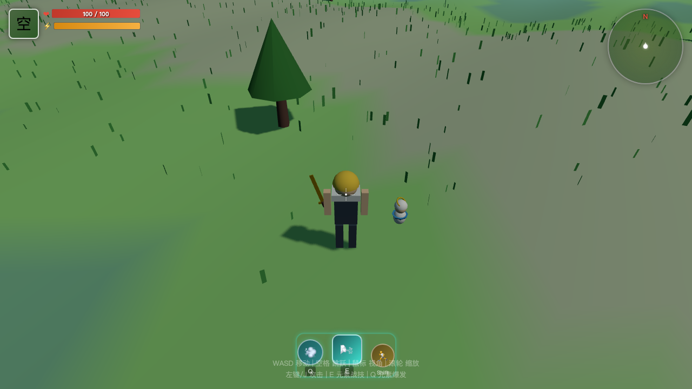

# 迷你原神 3D Demo

基于 Three.js + Vite + TypeScript 的网页版 3D 迷你原神可玩 Demo。



## 在线体验

```bash
npm install
npm run dev
```

浏览器打开 http://localhost:5173/，点击画面即可开始游戏。

## 操作方式

| 按键 | 功能 |
|------|------|
| W/A/S/D | 移动 |
| 空格 | 跳跃 |
| 鼠标 | 控制视角 |
| 滚轮 | 缩放视角 |
| 左键 / J | 普通攻击 |
| E / Q | 元素战技（风涡剑） |
| ESC | 暂停 / 显示菜单 |

## 已实现功能

### 核心系统
- **3D 渲染引擎**：Three.js 场景、光照、阴影、雾效
- **第三人称相机**：鼠标控制视角，滚轮缩放，平滑跟随
- **输入系统**：键盘 + 鼠标指针锁定

### 角色
- **旅行者（空）**：程序化几何体角色模型，含行走/跳跃/攻击/技能动画
- **派蒙 NPC**：跟随玩家移动，靠近时触发随机对话

### 世界
- **起伏地形**：噪声函数生成的自然地形
- **植被**：40 棵树木、30 块岩石、5000 株草地
- **天空**：天空盒 + 云层

### 战斗
- **普通攻击**：近战挥剑动画
- **风涡剑（元素战技）**：向前释放风元素攻击，5 秒冷却
- **伤害数字**：浮动伤害显示

### UI
- 角色头像 + 血条/体力条
- 小地图
- 技能栏（元素战技 / 元素爆发 / 冲刺）
- 十字准星
- 对话系统
- 暂停菜单

## 技术栈

- [Three.js](https://threejs.org/) — 3D 渲染
- [Vite](https://vitejs.dev/) — 构建工具
- TypeScript — 类型安全

## 项目结构

```
src/
  core/
    Game.ts           # 游戏主循环
    InputManager.ts   # 输入处理
  player/
    Player.ts         # 玩家控制器
    PlayerModel.ts    # 角色模型与动画
    CameraController.ts # 第三人称相机
  world/
    Terrain.ts        # 地形生成
    Environment.ts    # 天空、光照、雾效
  npc/
    Paimon.ts         # 派蒙 NPC
  ui/
    HUD.ts            # 游戏界面
```

## 开发

```bash
# 安装依赖
npm install

# 开发模式
npm run dev

# 构建
npm run build

# 预览
npm run preview
```

## License

MIT
